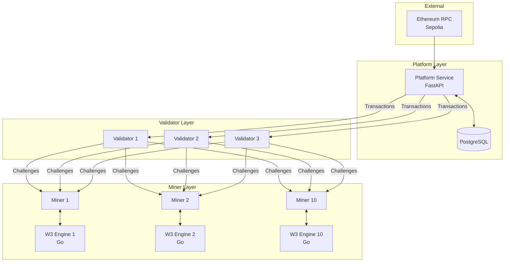
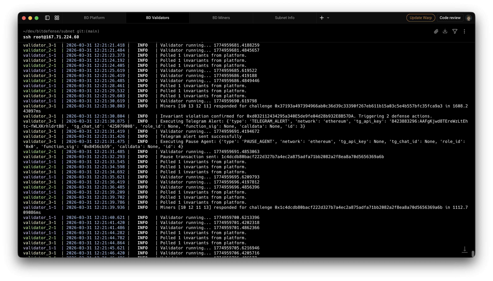
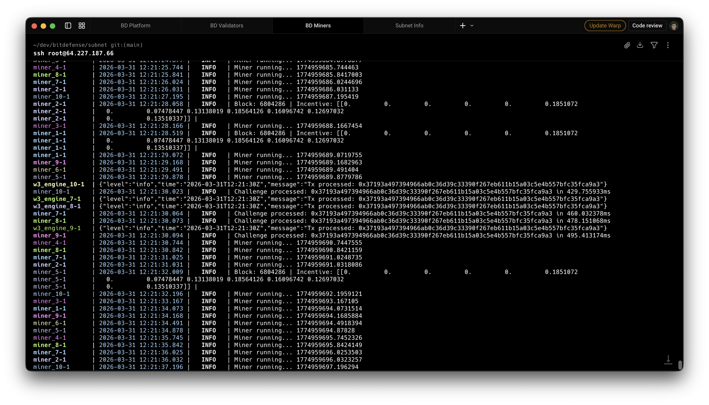
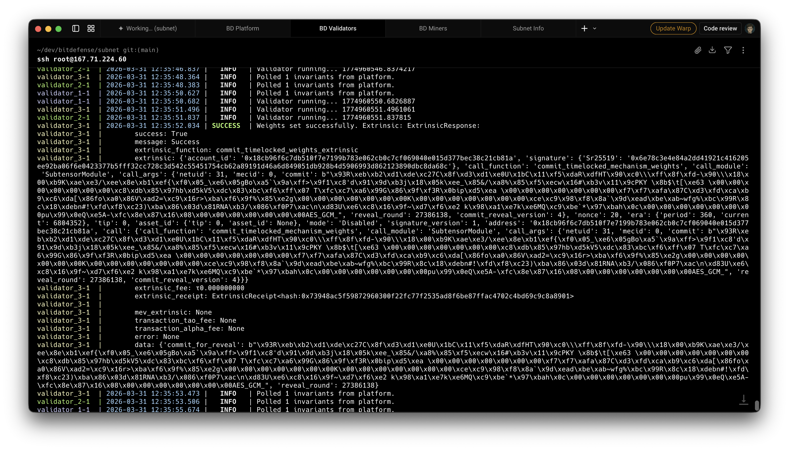
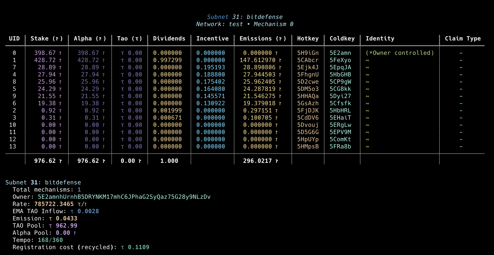

# **BitDefense Subnet** <!-- omit in toc -->

---

- [Architecture Diagram](#architecture-diagram)
- [Quick Start (Functional Demonstration)](#quick-start-functional-demonstration)
  - [Prerequisites](#prerequisites)
  - [Local Setup](#local-setup)
  - [Docker Compose](#docker-compose)
- [Technical Deep-Dive](#technical-deep-dive)
  - [The Challenge Protocol](#the-challenge-protocol)
  - [Miner Logic](#miner-logic)
  - [Validator Evaluation Flow](#validator-evaluation-flow)
  - [Incentive Mechanism](#incentive-mechanism)
- [Proof of Testnet Deployment](#proof-of-testnet-deployment)
  - [Operational Logs](#operational-logs)
  - [Transaction Hashes](#transaction-hashes)
  - [Performance Visuals](#performance-visuals)
- [License](#license)

---

## Architecture Diagram



## Quick Start (Functional Demonstration)

### Prerequisites
- [uv](https://github.com/astral-sh/uv) - Fast Python package manager.
- [Docker](https://www.docker.com/) & [Docker Compose](https://docs.docker.com/compose/) - For containerized deployment.

### Local Setup
1. **Sync dependencies:**
   ```bash
   uv sync
   ```
2. **Run Platform Service:**
   ```bash
   uv run python -m platform_service.main --rpc_url <YOUR_ETH_WS_URL>
   ```

### Docker Compose
Run the entire stack (Platform, Validator, Miner, W3 Engine) using Docker Compose:
```bash
docker-compose up --build
```

## Technical Deep-Dive

### The Challenge Protocol
The core communication between Validators and Miners is defined in `template/protocol.py` via the `Challenge` synapse. Each challenge is a `bt.Synapse` containing:
- `chainId`: The Ethereum network identifier (e.g., "1" for Mainnet, "11155111" for Sepolia).
- `blockNumber`: The block height at which the transaction is being evaluated.
- `tx`: A dictionary containing the raw Ethereum transaction data (hash, from, to, input, etc.).
- `invariants`: A list of invariants specifying the contracts and storage slots to monitor.

### Miner Logic
Miners receive `Challenge` requests and use the `neurons/miner/engine.py` to verify if the transaction violates any provided invariants.
- **`SafeOnlyInvariantsCheckEngine`**: A lightweight engine for basic validation.
- **`RemoteInvariantsCheckEngine`**: Connects to the high-performance Go-based `w3_engine` to perform deep EVM state analysis and invariant checking.
Miners report their findings back to the Validator for consensus.

### Validator Evaluation Flow
Validators act as the orchestrators of the subnet:
1. **Polling:** They poll the **Platform Service** for mempool transactions and active invariants.
2. **Challenge Creation:** For each transaction, the Validator constructs a `Challenge` object.
3. **Distribution:** Challenges are broadcast to multiple Miners in the subnet.
4. **Consensus:** The Validator aggregates Miner responses to confirm if a transaction is a violation.

### Incentive Mechanism
Scoring is handled in `neurons/validator/reward.py`, ensuring Miners are incentivized for high-quality protection. Rewards are calculated based on:
- **Throughput:** Total volume of transactions processed.
- **Accuracy:** Correctness of the Miner's responses compared to the subnet consensus.
- **Latency (L99):** The 99th percentile response time, ensuring near real-time protection.

## Proof of Testnet Deployment

### Operational Logs
#### Validator Activity

*Logs showing validators polling invariants from the platform, broadcasting challenges, and triggering defense actions (Telegram alerts and Pause agents).*

#### Miner Activity

*Logs showing miners receiving challenges, processing them via the W3 engine, and earning incentives.*

### Transaction Hashes

**Recent Weight Setting Extrinsic:** `0x73948ac5f59872960300f22fc77f2535ad8f6be87ffac4702c4bd69c9c8a8901`
*Proof of successful weight setting on the Bittensor testnet.*

### Subnet Status & Performance

*Overview of Subnet 31 (BitDefense) on the test network, displaying stakes, incentives, and emissions for active UIDs.*

### Registered Hotkeys

#### Validators
| Identity | UID | Hotkey |
| :--- | :--- | :--- |
| validator_1 | 1 | `5CAbcrX6dDoCLYZrXzNCU9csL8JctBxhi9oZcvtc8hqz5Pri` |
| validator_2 | 2 | `5FjDJK421Gj8oZKkKXWkexnadqpvCxhEnjtWABakkvDS8TXB` |
| validator_3 | 3 | `5CdDV6MiEwSf3Veu8xC4Z27usZeTWvT6Q3452Eh4hvV71oqq` |

#### Miners
| Identity | UID | Hotkey |
| :--- | :--- | :--- |
| miner_1 | 4 | `5FhgnUWorKmnBFJhGhgZdU1XFdo5LZH5SDEf56aErLkKCeew` |
| miner_2 | 5 | `5DM5o384xnjsohycyLxX9umWKybCJLVoSjwzYBZ8NUwy5zXj` |
| miner_3 | 6 | `5GsAzhqAnroU8KsuiVHR3YH2sWiMaj2n5B46Cz6NWvVpa7pN` |
| miner_4 | 7 | `5Ejk4JD1fuN6VDNujZSLvv4UqofWVNELGDSWPUuJAWjw7qrU` |
| miner_5 | 8 | `5D2cweLPj6JRqXohVbC8ovtNuydc5iCwehZM6FgE2XFKL4gf` |
| miner_6 | 9 | `5HHAQa6tVWW8j3SKegwGvboXSMDkXvd8T8hB5shk2YdJhQEz` |
| miner_7 | 10 | `5DvoujmTuxJvrPzzUF2yLXsJMbzTvoJzGHGRNhV5EEwDYNPZ` |
| miner_8 | 11 | `5D5G6Gc11bGVxRgv1kCd37hJ7RfDqdd2gwNMEVTz2MRByHfH` |
| miner_9 | 12 | `5HpUYpL1kpzcyx6jZ8dBa11qrp9sLMiKpoythup3EMeu8mFi` |
| miner_10 | 13 | `5HMpsB6SwG2k1h6eyNrG8yDaj2zJ4s4c2ATiZHoBjg85Cbu2` |

## License
This repository is licensed under the MIT License.
```text
# The MIT License (MIT)
# Copyright © 2024 Opentensor Foundation

# Permission is hereby granted, free of charge, to any person obtaining a copy of this software and associated
# documentation files (the “Software”), to deal in the Software without restriction, including without limitation
# the rights to use, copy, modify, merge, publish, distribute, sublicense, and/or sell copies of the Software,
# and to permit persons to whom the Software is furnished to do so, subject to the following conditions:

# The above copyright notice and this permission notice shall be included in all copies or substantial portions of
# the Software.

# THE SOFTWARE IS PROVIDED “AS IS”, WITHOUT WARRANTY OF ANY KIND, EXPRESS OR IMPLIED, INCLUDING BUT NOT LIMITED TO
# THE WARRANTIES OF MERCHANTABILITY, FITNESS FOR A PARTICULAR PURPOSE AND NONINFRINGEMENT. IN NO EVENT SHALL
# THE AUTHORS OR COPYRIGHT HOLDERS BE LIABLE FOR ANY CLAIM, DAMAGES OR OTHER LIABILITY, WHETHER IN AN ACTION
# OF CONTRACT, TORT OR OTHERWISE, ARISING FROM, OUT OF OR IN CONNECTION WITH THE SOFTWARE OR THE USE OR OTHER
# DEALINGS IN THE SOFTWARE.
```
